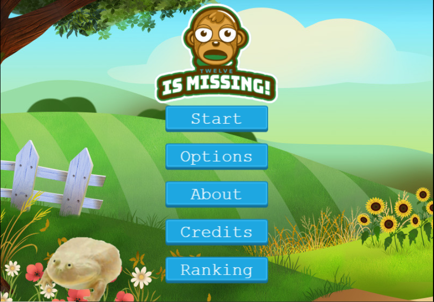
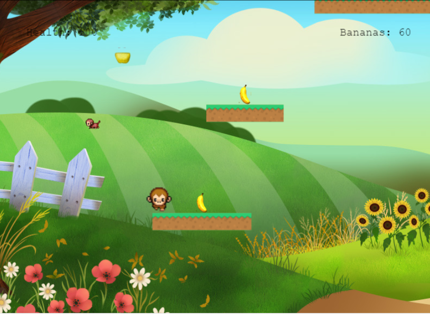
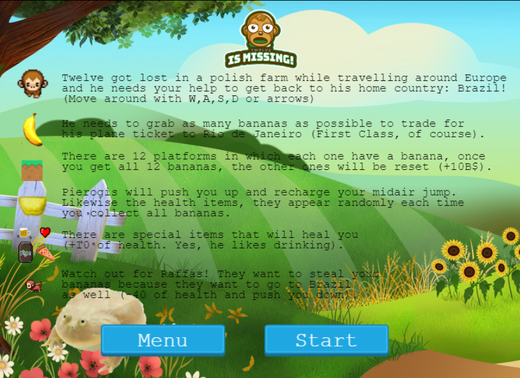

# Twelve is Missing!

> This projects consists of a Javascript Platform Game built with Phaser 3, as aked for in the Microverse Program.




> *"I don't know anything about this Cyberpunk 2077 that is being released today... 'Twelve is Missing' is the epitome of gaming!" - IGN*

> *"A delayed game is eventually good but a rushed game is forever bad, 'Twelve is Missing!' took as long as it needed" - Shigeru Miyamoto*

> *"AA-OO" - Twelve Demanky*


## Live Demo

[Live Demo Link](https://twelveismissing.herokuapp.com/)

## Game Concept

> Twelve Demanky got lost on one of his trips and now he needs to go back home. Plane tickets from Wroclaw do Rio de Janeiro are not cheap and he needs to make ends meet! 

## Main Objective

> Collect 500 B$ to buy the plane ticket.
> Beat other players' highscores!

## Game instructions:

> Here you can find all the Game Instructions:
- Move around with W,A,S,D;
- You can double jump once while in the air;
- Health item give you +10 of health;
- Enemies take out -40 of health;
- There are items that give you an extra jump midair once;
- Once you get all the bananas, the other ones are reset and you can collect them again;
- If you collect 50 bananas you can end up with the Congratulations Game Over.




## Prerequisites
- NPM package and JavaScript knowledge.

## Getting Started

To get a local copy up and running follow these simple example steps.

```
git clone https://github.com/abouhid/JS_Game.git
npm install
npm run start
Open http://localhost:3000/ on your browser.
```
## Testing

- You can run tests by running 'npm test'

## Built With

- Javascript
- HTML
- Phaser 3
- Webpack
- Node.js
- Babel
- Leaderboard API
- JEST testing
- Heroku
- ESlint and Stylelint as linters

## Authors


👤 **Alexandre Bouhid**

- Github: [@abouhid](https://github.com/abouhid)
- LinkedIn: [Alexandre Bouhid](https://www.linkedin.com/in/alexandrebouhid/)

## 🤝 Contributing

Contributions, issues and feature requests are welcome!

## 🤝 Acknowledgments

Special thanks for the help during this project to: 

-Sarah Uryelah Silva Chamorro
-Michael Threels
-Azamat Nuriddinov

## Show your support

Give a ⭐️ if you like this project!

## 📝 License

This project is [MIT](lic.url) licensed.
